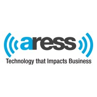

  

  
  
  

  Cloud-native systems, real-time data, and infra that doesn't fall over.

---

### Experience

<table>
<tr>
<td width="60" align="center"></td>
<td><a href="https://ibm.com"><strong>IBM</strong></a> · <em>Incoming Software Engineer</em> Cloud · distributed systems</td>
</tr>
<tr>
<td width="60" align="center"></td>
<td><a href="https://kalshi.com"><strong>Kalshi</strong></a> · <em>Quantitative Developer Intern</em> C++ hedging engine · real-time WebSocket pipeline</td>
</tr>
<tr>
<td width="60" align="center"></td>
<td><a href="https://aress.com"><strong>Aress Software</strong></a> · <em>ML Intern</em> PyTorch on 500k+ records</td>
</tr>
<tr>
<td width="60" align="center"></td>
<td><a href="https://humecenter.vt.edu"><strong>Hume Center @ VT</strong></a> · <em>Systems Engineering Intern</em> Concurrent C++ imaging for CubeSats</td>
</tr>
</table>

---

### Projects

| Project | What it does |
|:---|:---|
| [**Refrax**](https://refrax.io) | Quant modeling platform with 2D/3D viz |
| [**GreenSticker**](https://greensticker.us) | Hands-free cursor via on-device color tracking |
| [**Autism Research Tool**](https://autismtester.com) | Screening experiments with research-grade UX |
| [**PIVOT Platform**](https://vtpivot.org) | Multi-university STEM research collaboration |

---

### Stack

  

---

**NYU Courant** · B.A. Math & Computer Science · May 2027
